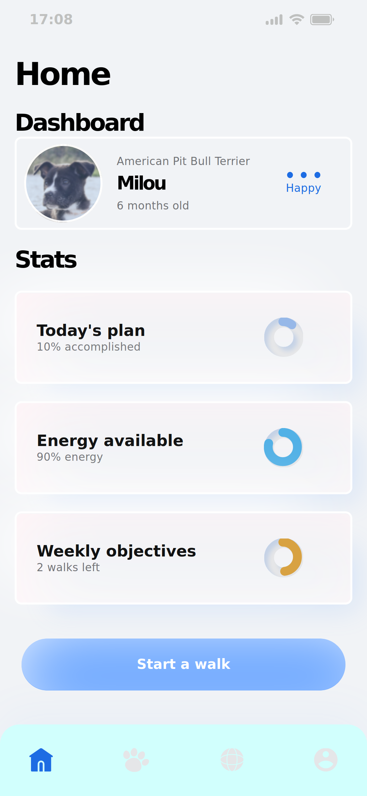
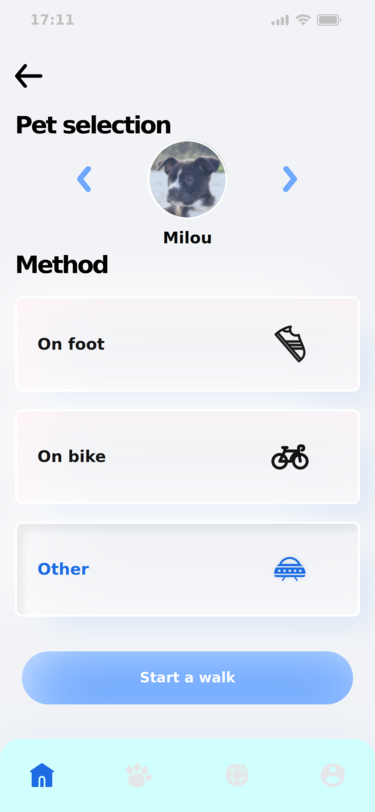
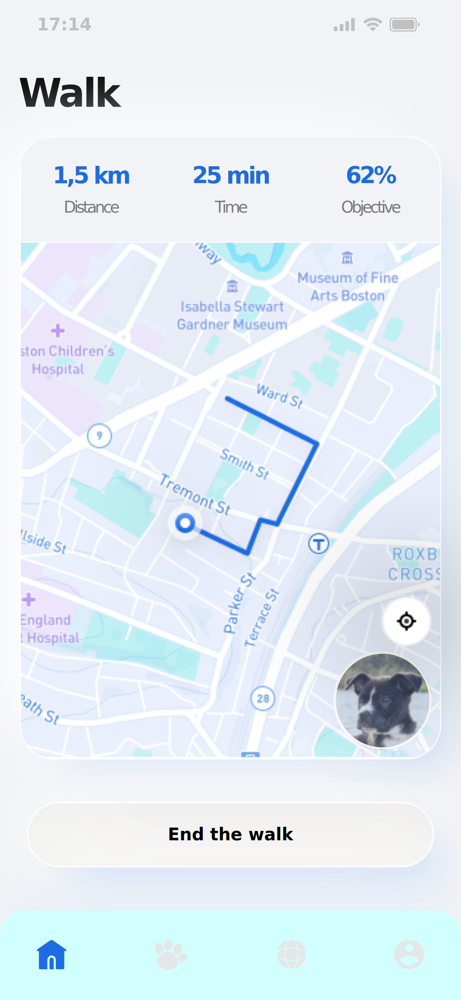
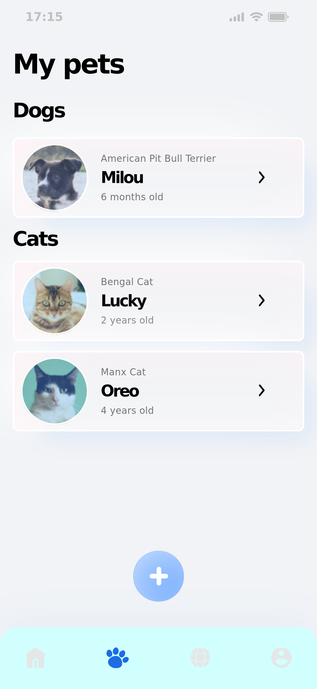
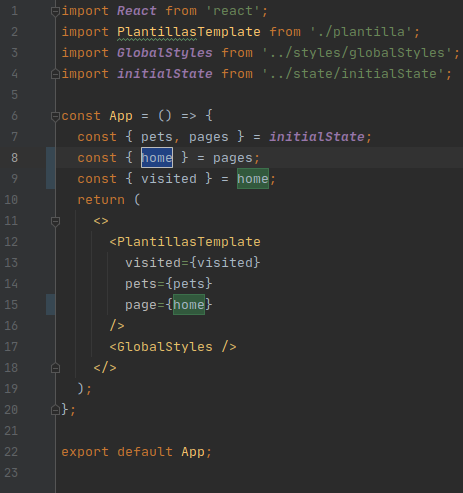
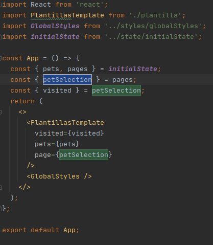
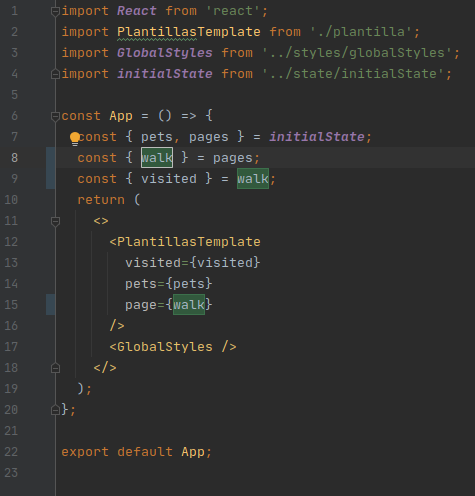
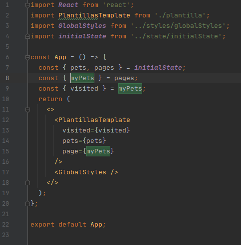

# :hibiscus: Pet walk - Plantillas :hibiscus:

## 📝 Table of Contents

* [Acerca del poryecto](#-acerca-del-proyecto)
  * [Plantillas](#-plantillas)
* [Getting Started](#getting-started)
* [Modo de uso local](#modo-de-uso-local)
* [Creado con](#creado-con)
* [Contacto](#contacto)
* [Agradecimientos](#agradecimientos)

<!-- ACERCA DEL PROYECTO -->
## 👉 Acerca del proyecto

En este proyecto se crearon 4 diferentes plantillas, para una aplicación movil, utilizando React desde cero.
Se estructuró el layout y se ajustó a los requerimientos de diseño pedidos, con un viewport máximo 416 x 812 pixeles, y uno ideal de 375 x 812 pixeles, que puede ser explorado a traves de las developer tools de tu navegador favorito.

En la live version se presenta la plantilla con más componentes y animaciones de todas las construidas.

[<p align="center">Live Version</p>](https://pet-walk.netlify.app/)

En el pull-request se pueden apreciar las linters de Eslint que verifican el código escrito por medio de las GitHub Actions.

[<p align="center">Pull-request</p>](https://github.com/Luzaks/pet-walk/pull/1)

## 👉 Pet walk

Pet walk consiste en cuatro plantillas client side desarrolladas en React con maquetación reusable y estructurada de acuerdo a esto, dentro del proyecto. 
Se decidió hacerlo de esta forma para mostrar con mayor claridad la reusabilidad de los estilos y componentes. 

### 👉 Plantilla uno
  
<div align="center"></div>


### 👉 Plantilla dos

<div align="center"></div>


### 👉 Plantilla tres

<div align="center"></div>


### 👉 Plantilla cuatro

<div align="center"></div>


## Getting started

*   Haz click en el botón Code, en el repositorio, y copia la dirección. 
*   Navega, en tu bash favorita y corre:
```
git clone [dirección copiada]
cd [nombre del repositorio]
npm i
npm start
```

Una nueva ventana se abrirá en tu navegador predeterminado.

*   En una pestaña diferente de tu bash, para revisar las linters de forma local, dentro de la misma carpeta del proyecto puedes correr:
```
npx eslint .
```

## Modo de uso local

Para navegar a través de las plantillas será necesario cambiar la página visitada de forma manual, en el componente App dentro de la carpeta containers, cambiando el nombre de la plantilla  en las líneas 8, 9 y 15, de la siguiente manera indicada:

*   Plantilla Uno:
    Es la plantilla predeterminada por defecto, la línes 8, 9 y 15 indican que se trata de la plantilla home o plantilla uno, por favor escribe home como en las zonas destacadas que se muestran en la imagen.

<div align="center"></div>

*   Plantilla Dos:
    Es la plantilla diseñada para la sección de una mascota, la línes 8, 9 y 15 indican que se trata de la plantilla petSelection o plantilla dos, por favor escribe petSelection como en las zonas destacadas que se muestran en la imagen.

<div align="center"></div>

*   Plantilla Tres:
    Es la plantilla diseñada para indicar la ubicación y ruta del pase con su mascota, la línes 8, 9 y 15 indican que se trata de la plantilla walk o plantilla tres, por favor escribe walk como en las zonas destacadas que se muestran en la imagen.

<div align="center"></div>

*   Plantilla Cuatro:
    Es la plantilla diseñada para observar a todas las mascotas que pertenecen al usuario, la línes 8, 9 y 15 indican que se trata de la plantilla myPets o plantilla cuatro, por favor escribe myPets como en las zonas destacadas que se muestran en la imagen.

<div align="center"></div>

Se decidió utilizar esta forma de navegar entre plantillas para mostrar de forma más explícita la reusabilidad de los componentes.

### 🛠 Creado con

*   React.js 
*   JSX
*   Styled Components
*   Prop-Types
*   ES6
*   npm
*   Eslint
*   Webpack

<!-- CONTACT & SUPPORT -->
## Contact & Support

🙍 Guadalupe Rangel - kanemekanik@gmail.com - ☄

Te gustó? ⭐️ Da estrellita al proyecto!!!
