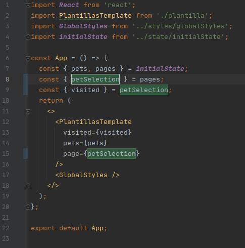

# :hibiscus: Pet walk - Plantillas :hibiscus:

[<p align="center">Live Version</p>]()

## 📝 Table of Contents

* [Acerca del poryecto](#-acerca-del-proyecto)
  * [Plantillas](#-plantillas)
* [Getting Started](#getting-started)
* [Modo de uso local](#modo-de-uso-local)
* [Creado con](#creado-con)
* [Contacto](#contacto)
* [Agradecimientos](#agradecimientos)

<!-- ACERCA DEL PROYECTO -->
## 👉 Acerca del proyecto

En este proyecto se crearon 4 diferentes plantillas, para una aplicación movil, utilizando React desde cero.
Se estructuró el layout y se ajustó a los requerimientos de diseño pedidos.

## 👉 Pet walk

Pet walk consiste en cuatro plantillas client side, las cuales son las siguientes:

### 👉 Plantilla uno
  
<div align="center"></div>


### 👉 Plantilla dos

<div align="center"></div>


### 👉 Plantilla tres

<div align="center"></div>


### 👉 Plantilla cuatro

<div align="center"></div>


## Getting started

*   Haz click en el botón Code, en el repositorio, y copia la dirección. 
*   Navega, en tu bash favorita y corre:
```
git clone [dirección copiada]
cd [nombre del repositorio]
npm i
npm start
```

Una nueva ventana se abrirá en tu navegador predeterminado.

## Modo de uso local

Para navegar a través de las plantillas será necesario cambiar la página visitada de forma manual, en el componente App dentro de la carpeta containers, cambiando el nombre de la plantilla  en las líneas 8, 9 y 15, de la siguiente manera indicada:

*   Plantilla Uno:
    Es la plantilla predeterminada por defecto, la línes 8, 9 y 15 indican que se trata de la plantilla home o plantilla uno.

<div align="center"></div>

*   Plantilla Dos:
    Es la plantilla diseñada para la sección de una mascota, la línes 8, 9 y 15 indican que se trata de la plantilla petSelection o plantilla dos.

<div align="center"></div>

*   Plantilla Tres:
    Es la plantilla diseñada para indicar la ubicación y ruta del pase con su mascota, la línes 8, 9 y 15 indican que se trata de la plantilla walk o plantilla tres.

<div align="center"></div>

*   Plantilla Cuatro:
    Es la plantilla diseñada para observar a todas las mascotas que pertenecen al usuario, la línes 8, 9 y 15 indican que se trata de la plantilla myPets o plantilla cuatro.

<div align="center"></div>

Se decidió utilizar esta forma de navegar entre plantillas para mostrar de forma más explícita la reusabilidad de los componentes.

### 🛠 Creado con

*   React.js 
*   JSX
*   Styled Components
*   Prop-Types
*   ES6
*   npm
*   Eslint
*   Webpack

<!-- CONTACT & SUPPORT -->
## Contact & Support

🙍 Guadalupe Rangel - kanemekanik@gmail.com - ☄

Te gustó? ⭐️ Da estrellita al proyecto!!!
